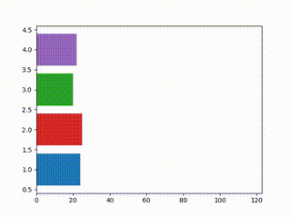
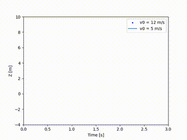

## Hi there 👋, je suis Boussad ait djoudi
<div align="center">

</div>
## 📊 Data Scientist passionné | Python & SQL | IA & Big Data

### 🎓 Formation

- **Master 1 Développement, IA & Big Data** - IPSSI Paris *(En cours)*
- **Master en Systèmes Informatiques Intelligents** - Université Mouloud Mammeri Tizi Ouzou

### 💼 Profil

Senior Data Scientist à la recherche d'un **stage de 2 mois** pour mettre à profit mon expertise et ma passion pour la data science. Je combine des compétences techniques solides avec une compréhension approfondie des enjeux business liés aux données.

### 🛠️ Compétences techniques

```python
skills = {
    "Langages": ["Python", "SQL", "R"],
    "Data Analysis": ["Pandas", "NumPy", "Matplotlib", "Seaborn"],
    "Machine Learning": ["Scikit-learn", "TensorFlow", "Keras", "PyTorch"],
    "Big Data": ["Spark", "Hadoop", "MongoDB"],
    "Outils": ["Jupyter", "Git", "Docker", "AWS", "power BI"]
}
```


<div align="center">
  
</div>

### 💡 À propos de moi

Passionné par la data science et l'intelligence artificielle, j'aime relever des défis complexes et transformer des données brutes en insights stratégiques. Je cherche constamment à améliorer mes compétences et à me tenir informé des dernières avancées technologiques dans le domaine.

### 📫 Contact

- 📧 Email : [votre.email@example.com](mailto:aitdjoudioufellaboussad@gmail.com)
- 🔗 LinkedIn : [linkedin.com/in/votrenom](https://www.linkedin.com/in/boussad-ait-djoudi-oufella-bb5882217/)

---

⭐️ N'hésitez pas à consulter mes projets ci-dessous et à me contacter pour toute opportunité de stage en Data Science !
